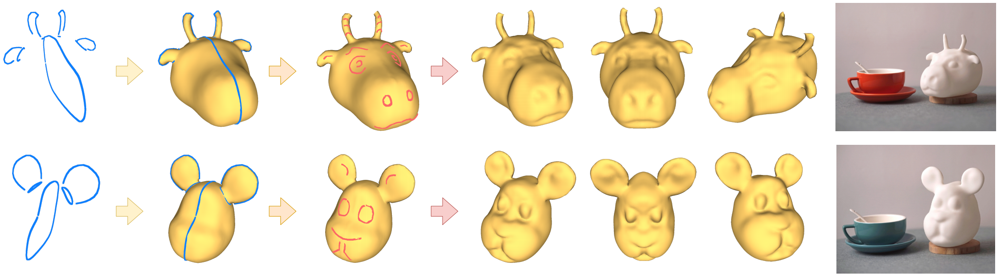

## *SimpModeling*: Sketching Implicit Field to Guide Mesh Modeling for 3D Animalmorphic Head Design

[Project page](https://zhongjinluo.github.io/SimpModeling/)

We present *SimpModeling*, a novel sketching system designed for amateur users to create desired animalmorphic heads. It provides two stages for mesh modeling: coarse shape sketching where users may create coarse head models with 3D curve handles (blue), and geometric detail crafting where users may add geometric surface details by drawing sketches (red) on the coarse models. The two animalmorphic head models in this figure were created by a novice user without any 3D modeling experiences in ten minutes.

<video src="docs/demo.mp4"></video>